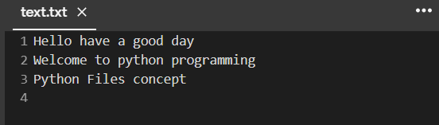

# Wire frame for a website

## AIM:
To design a wire frame for a website.

## DESIGN STEPS:

Step 1:
Assign a variable for value zero

Step 2:
open then required file by using the function "with"

Step 3:
Then use the for loop for assigning the i value in the file

Step 4:
using split function to split the words

Step 5:
Finding the length of the words by using len() function

Step 6:
Calling the function and printing the number of words.

## OUTPUT:

## Result:
Thus a wire frame is designed for a given website.
